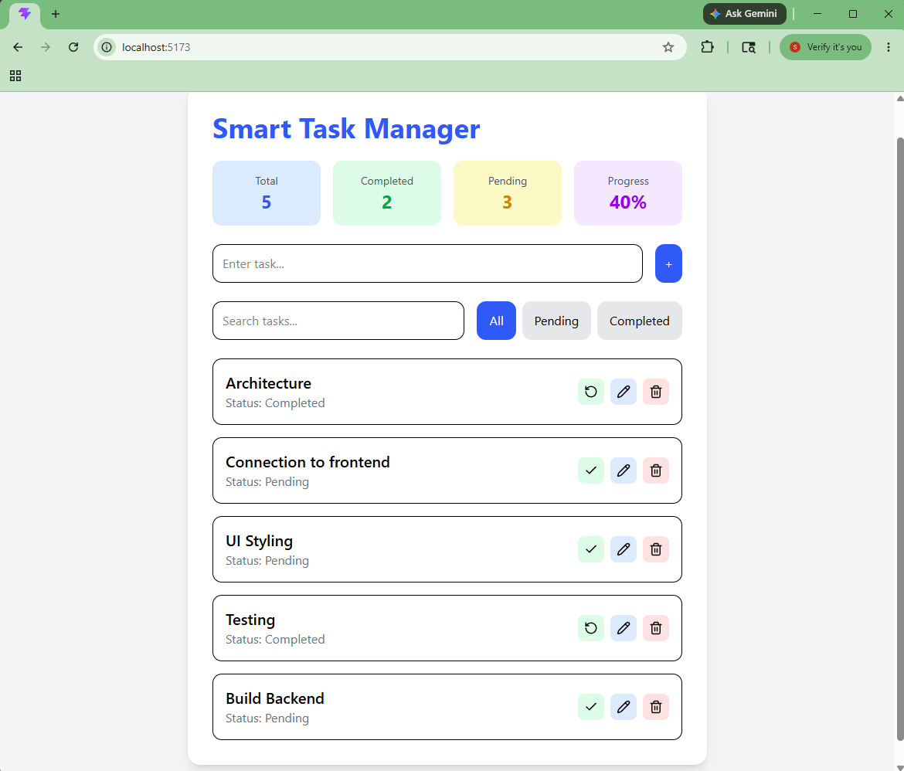
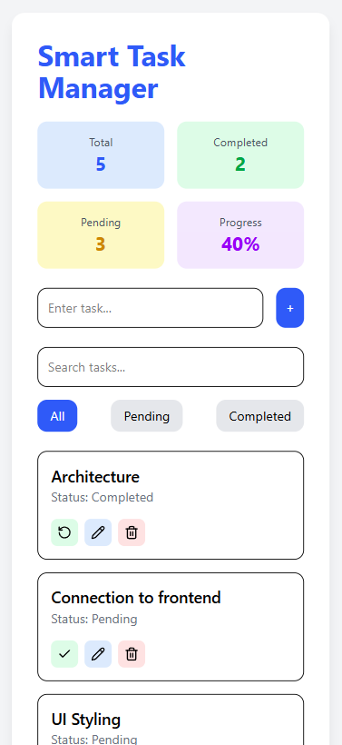
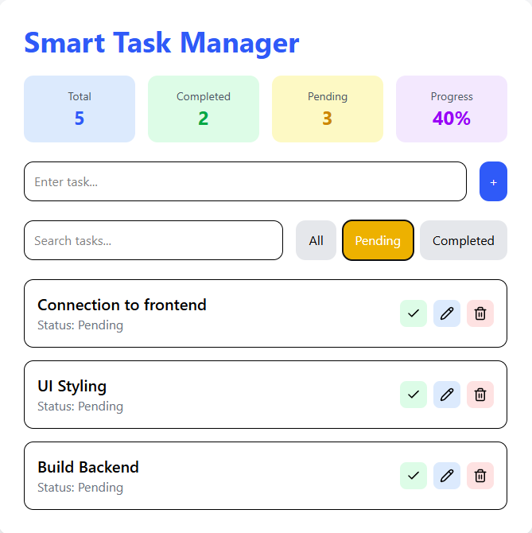
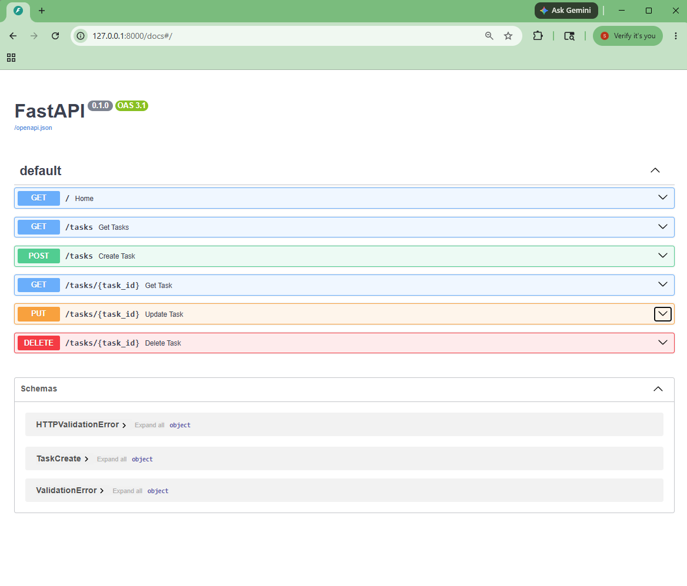

# Smart Task Manager

A full-stack task management application built using FastAPI, PostgreSQL, React, and Tailwind CSS.

This project demonstrates full-stack CRUD operations, REST API integration, responsive frontend development, database management, and modern UI/UX practices.

---

## Features

### Backend Features

* FastAPI REST APIs
* PostgreSQL database integration
* SQLAlchemy ORM
* Pydantic schema validation
* CRUD operations
* Modular route structure

### Frontend Features

* React + Vite frontend
* Tailwind CSS styling
* Responsive UI for mobile/tablet/desktop
* Add tasks
* Edit tasks
* Delete tasks
* Toggle completed/pending status
* Search tasks
* Filter tasks
* Toast notifications
* Dashboard statistics
* Tooltips and polished UX

---

## Tech Stack

### Frontend

* React
* Vite
* Tailwind CSS
* Axios
* Lucide React
* React Hot Toast

### Backend

* FastAPI
* Uvicorn
* SQLAlchemy
* Pydantic

### Database

* PostgreSQL
* pgAdmin 4

---

## Project Structure

```text
smart-task-manager/
│
├── backend/
├── frontend/
├── README.md
```

---

## Screenshots









---

## API Endpoints

### Get All Tasks

```http
GET /tasks
```

### Create Task

```http
POST /tasks
```

### Update Task

```http
PUT /tasks/{id}
```

### Delete Task

```http
DELETE /tasks/{id}
```

---

## Backend Setup

### Clone Repository

```bash
git clone <your-repository-url>
cd smart-task-manager
```

### Create Virtual Environment

```bash
python -m venv venv
```

### Activate Virtual Environment

#### Windows

```bash
venv\Scripts\activate
```

### Install Backend Dependencies

```bash
pip install -r backend/requirements.txt
```

### Run Backend

```bash
uvicorn backend.main:app --reload
```

Backend:

```text
http://127.0.0.1:8000
```

Swagger Docs:

```text
http://127.0.0.1:8000/docs
```

---

## Frontend Setup

### Navigate to Frontend

```bash
cd frontend
```

### Install Frontend Dependencies

```bash
npm install
```

### Run Frontend

```bash
npm run dev
```

Frontend:

```text
http://localhost:5173
```

---

## Learning Highlights

This project helped in understanding:

* Full-stack architecture
* REST API development
* Database integration
* SQLAlchemy ORM
* React component architecture
* State management using hooks
* API communication using Axios
* Responsive UI design
* Professional UX improvements
* CRUD operations with persistent storage

---

## Future Improvements

* Authentication
* JWT authorization
* Dark mode
* Due dates
* Categories/tags
* Docker support
* Cloud deployment
* CI/CD pipeline

---

## Author

Sangeeta Achari

GitHub: https://github.com/Sangeeta1512/
